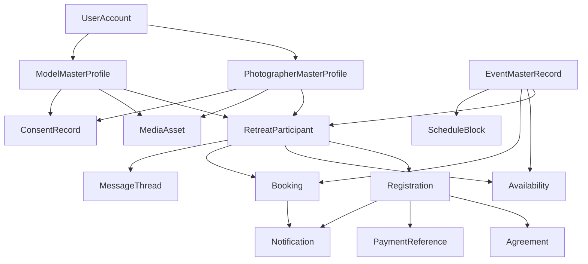
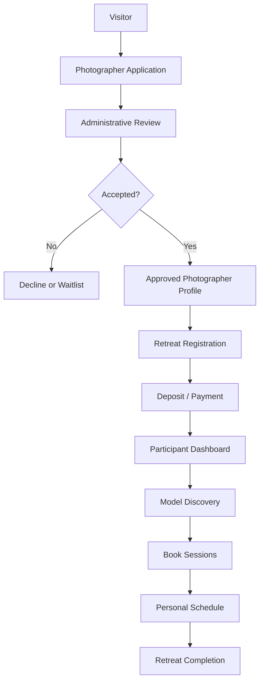
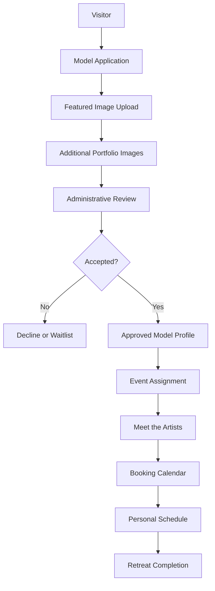
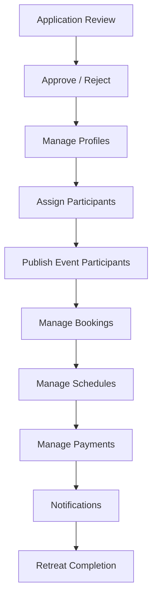
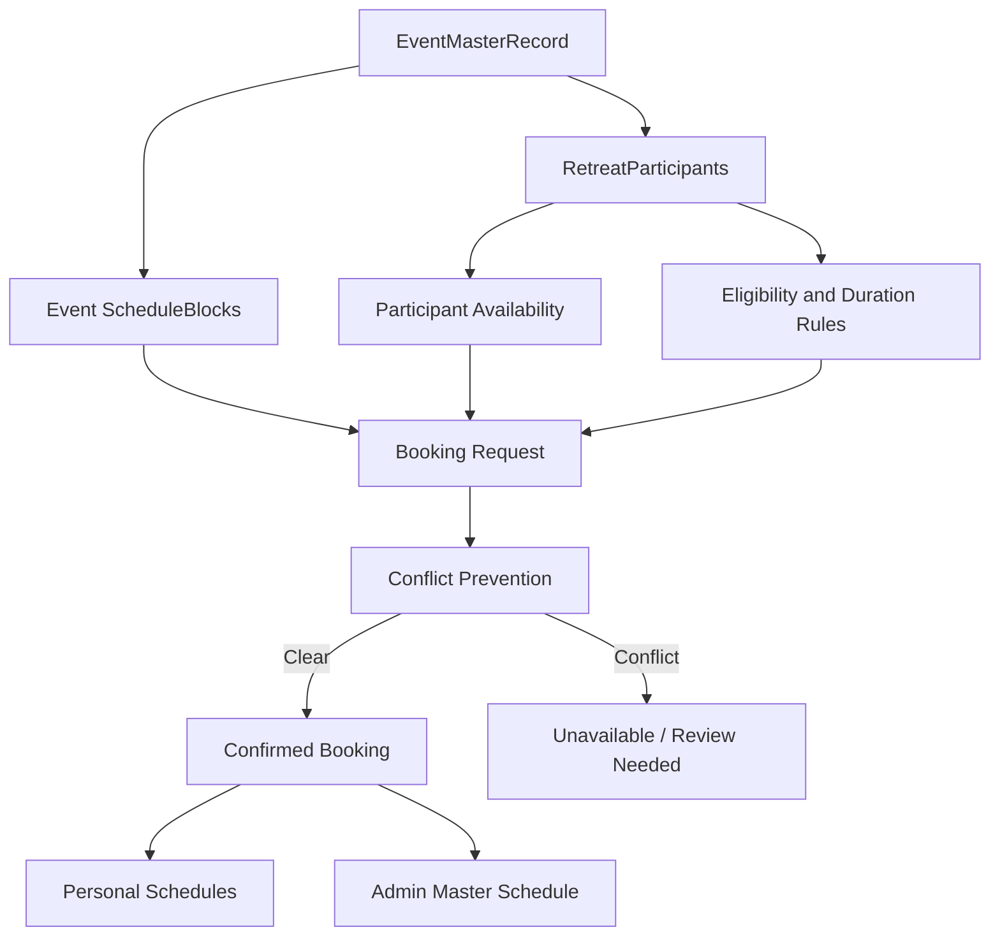

# Lone Star Retreat Operations Architecture

Version 0.1 — Sprint 04B architecture draft

## Purpose

This document defines the operational foundation for Lone Star Retreat before
production participant workflows are implemented.

The objective is to make the retreat feel simple for the people participating:

- models model,
- photographers shoot,
- administrators guide and protect the experience, and
- the platform carries the operational burden.

The architecture was approved for implementation through Mission 05. Mission 05
may activate the existing booking and artist-availability foundation for
authenticated participants and administrators. Payments, public booking,
messaging, SMS, calendar sync, and notification automation remain unauthorized.

Mission 05 retains embedded event participant assignments for Version 1,
treats `admin-review` as an active administrative exception rather than an
approval queue, and derives 60-minute ranges rather than persisting slot rows.
Photographer and model personal schedules must remove ambiguity by showing the
event-local time, duration, partner, event location, status, administrator
changes, and only the partner contact methods approved for an active confirmed
booking.

## Operating philosophy

Privacy is the default. Sharing is always the participant's choice.

Public pages, participant portals, administrator tools, notifications, and
schedule views must each receive only the fields they are allowed to know. The
system should make the safe path the easy path: no one should need to remember
which private field must be hidden from which surface.

## Current architecture validation

The existing foundation is directionally correct and should be preserved.

| Architecture concept | Current implementation | Validation |
| --- | --- | --- |
| `UserAccount` | `users` | Correctly separated from role-specific profiles. Supports multiple roles, account status, staff permissions, suspension, invitation, and audit events. |
| `PhotographerMasterProfile` | `photographer-profiles` | Correct canonical photographer record. Should remain separate from applications, registrations, bookings, payments, and event participation. |
| `ModelMasterProfile` | `model-profiles` | Correct canonical model / featured artist record. Public-display approvals and approved media controls already match the privacy philosophy. |
| `EventMasterRecord` | `retreat-events` | Correct event-owned record. It already owns lifecycle, dates, location, registration status, and event-specific participant assignments. |
| `RetreatParticipant` | Currently represented as event assignment arrays inside `retreat-events` | Acceptable for the current Founders Edition scale. Should become a normalized collection before complex registration, payments, attendance, or per-event participant state grows. |
| `Registration` | Future | Should be event-specific and reference `UserAccount`, canonical profile, event, status, agreements, payment references, and registration timestamps. |
| `Booking` | `retreat-bookings` | Correct private operational record. It references event, model, photographer, exact UTC times, status, and administrator override data. |
| `Availability` | `artist-availability` | Correct event-specific availability record for models. Photographer availability should be added as a parallel concept before photographer schedule constraints are enforced. |
| `ScheduleBlock` | Future | Should represent event-owned non-booking schedule commitments such as meals, arrivals, orientation, group activities, location windows, and blackout periods. |
| `MediaAsset` | `media` | Correct shared media record. Approved-use gating and generated media sizes should remain centralized. |
| `ConsentRecord` | Future | Needed before broader publication, portfolio, agreements, and post-retreat reuse workflows. |
| `Agreement` | Future | Needed for code of conduct, liability, model release, photographer terms, cancellation terms, and payment terms. |
| `PaymentReference` | Future | Needed for Stripe or other provider references. Store provider IDs and status only; never store card data. |
| `Notification` | Future | Needed as a delivery ledger and preference-aware event record. Should not duplicate business logic. |
| `MessageThread` | Future | Optional later. Should be introduced only after clear moderation, retention, and privacy rules exist. |

## Recommended normalized model

The existing profile and event records should remain canonical. Future
implementation should add transactional records around them rather than
duplicating profile data.

### Canonical record rules

1. `UserAccount` answers: who can sign in?
2. `PhotographerMasterProfile` answers: who is this photographer across the
   platform?
3. `ModelMasterProfile` answers: who is this model / featured artist across the
   platform?
4. `EventMasterRecord` answers: what is this retreat edition?
5. `RetreatParticipant` answers: who is participating in this specific event,
   in what role, and with what event-specific status?
6. `Registration` answers: what commercial/admission state connects this
   person to this event?
7. `Booking` answers: what confirmed or proposed session occupies time between
   one photographer and one model for one event?
8. `Availability` answers: when may a participant be booked for this event?
9. `ScheduleBlock` answers: what event-owned commitments shape everyone’s day?

## Participant lifecycle architecture

### Photographer journey

#### Photographer state transitions

| Stage | Primary record | Notes |
| --- | --- | --- |
| Visitor | none | Public content only. No account required. |
| Photographer Application | `PhotographerApplication` | Private staff-only review record. Does not publish anything automatically. |
| Administrative Review | `PhotographerApplication` | Status moves through new, reviewing, accepted, declined, or waitlist. |
| Approved Photographer Profile | `PhotographerMasterProfile` | Canonical profile is created or updated after review. |
| Retreat Registration | `Registration` | Future event-specific commercial/admission record. |
| Deposit / Payment | `PaymentReference` | Future provider-backed record. Store references, not payment instrument data. |
| Participant Dashboard | Participant projection | Future surface. Reads allowlisted registration, logistics, schedule, and booking data. |
| Model Discovery | Event participant projection | Shows only models approved for the photographer’s event and role. |
| Book Sessions | `Booking` | Future mutation. Must enforce availability, duration, assignment, payment/registration status, and conflicts. |
| Personal Schedule | Schedule projection | Photographer sees their own booked sessions and shared event schedule. |
| Retreat Completion | Registration / Participant status | Completion should preserve history, releases, payments, and follow-up state. |

### Model journey

#### Model state transitions

| Stage | Primary record | Notes |
| --- | --- | --- |
| Visitor | none | Public content only. No account required. |
| Model Application | `ModelApplication` | Private staff-only review record. |
| Featured Image Upload | `MediaAsset` via application | Upload remains private until approved for platform use and linked to profile. |
| Additional Portfolio Images | `MediaAsset` via application | Optional portfolio candidates remain private until reviewed. |
| Administrative Review | `ModelApplication` | Review decides whether to decline, waitlist, accept, or deliberately create/link a draft canonical profile. |
| Approved Model Profile | `ModelMasterProfile` | Canonical model record with public-display approvals. Creating a draft profile from an accepted application does not publish it. |
| Event Assignment | `RetreatParticipant` | Event-specific status, booking eligibility, display order, minimum booking duration. |
| Meet the Artists | Public event projection | Derived from event assignment plus approved profile fields and approved media. |
| Booking Calendar | Availability / Booking projection | Future participant surface. |
| Personal Schedule | Schedule projection | Model sees their own sessions and event schedule. |
| Retreat Completion | Participant status | Completion preserves consent, attendance, payments, and follow-up history. |

### Administrator journey

#### Administrator responsibilities

| Responsibility | Architectural boundary |
| --- | --- |
| Application Review | Staff-only applications. Applications never publish public profile fields automatically. |
| Approve / Reject | Status changes should create audit events and preserve review history. |
| Manage Profiles | Canonical profiles remain separate from applications and event participation. |
| Assign Participants | Event-specific participation belongs to `RetreatParticipant`. |
| Publish Event Participants | Public display requires event approval, profile approval, approved media, and field-level public-display consent. |
| Manage Bookings | Operational booking records remain private; public and participant views use projections. |
| Manage Schedules | Event-owned schedule blocks and participant-specific bookings combine into personal schedules. |
| Manage Payments | Payment status belongs to registration/payment references, not profile records. |
| Notifications | Notifications should be generated from domain events and filtered by participant preferences. |
| Retreat Completion | Completion updates event participation, registration, payments, attendance, consent, and follow-up state. |

## Privacy architecture

Privacy must be enforced through data modeling, not convention.

### Visibility tiers

| Tier | Audience | Examples |
| --- | --- | --- |
| Public | Anyone | Event title, approved public description, approved artist name, approved featured media, approved public bio fields. |
| Participant-visible | Authenticated event participants | Personal schedule, shared event schedule, approved booking partner contact after confirmed booking. |
| Self-visible | The participant and authorized staff | Own profile, own bookings, own availability, own registration, own payment status. |
| Staff-only | Administrators | Applications, legal names, admin notes, review notes, emergency contacts, override reasons, payment references. |
| System-only | Server processes / audit | Tokens, provider secrets, raw delivery events, security-sensitive metadata. |

### Communication preferences

Canonical profiles should continue to own durable communication preferences:

- booking email,
- mobile phone,
- preferred contact method,
- email notification opt-in,
- SMS notification opt-in,
- dashboard notification opt-in,
- contact-sharing approvals,
- quiet hours or timing preferences where needed.

Event-specific overrides may be added later through `RetreatParticipant` when a
participant wants different preferences for a particular event.

### Contact visibility rules

Contact details should remain private until there is a confirmed operational
reason to share them.

| Scenario | Contact visibility |
| --- | --- |
| Public profile | No private contact details. Public website or Instagram only if explicitly approved. |
| Application review | Staff-only. |
| Event participant list | No private contact details. |
| Before booking | No photographer-to-model direct contact by default. |
| Confirmed booking | Share only fields each participant approved for post-booking sharing. |
| Cancelled booking | Preserve audit history; do not continue exposing newly unnecessary contact details unless policy says otherwise. |
| Administrator override | Staff may view operational contact data for safety and logistics. |

### Consent history

`ConsentRecord` should be introduced before expanding public display,
post-retreat image use, or agreement workflows. It should record:

- participant,
- role,
- event when applicable,
- consent type,
- policy or agreement version,
- accepted/revoked state,
- timestamp,
- actor,
- source surface,
- related media, profile, booking, or registration when applicable.

Consent should be append-only or versioned. Do not overwrite meaningful consent
history.

### Audit history

Administrative actions that change participant trust boundaries should produce
audit events:

- account role changes,
- account suspension/reactivation,
- application status changes,
- profile approval changes,
- public-display approval changes,
- event participant assignment changes,
- booking creation/cancellation/reschedule,
- administrator overrides,
- payment status changes,
- notification preference changes,
- consent acceptance or revocation.

## Scheduling architecture

Scheduling must combine participant availability, event-owned schedule blocks,
booking rules, and administrator controls without leaking private information.

### Core scheduling records

| Record | Purpose |
| --- | --- |
| `Availability` | Participant-specific bookable windows and blocked times for one event. |
| `Booking` | Exact session reservation between a photographer and model. |
| `ScheduleBlock` | Event-owned commitments such as arrival, orientation, meals, group shoots, venue access, travel buffers, and closing activities. |
| `RetreatParticipant` | Event-specific participant status, eligibility, role, and event-specific settings. |

### Scheduling flow

### Photographer availability

Photographer availability should be modeled before enforcing photographer
schedule constraints. It may use the same event/date/window/block pattern as
model availability, but should be a distinct role-aware projection so
photographers can manage:

- arrival and departure windows,
- preferred shooting windows,
- personal breaks,
- meal conflicts,
- equipment or travel constraints,
- maximum sessions per day,
- optional administrator-managed availability.

### Model availability

Model availability is already represented by `artist-availability`. It should
continue to support:

- event-specific dates,
- local event time,
- available-from / available-until,
- blocked time windows,
- lunch or rest blocks,
- administrator notes,
- protection of confirmed bookings.

### Booking windows and durations

Booking rules should support:

- event-wide booking open/close windows,
- model-specific minimum booking duration,
- future model-specific maximum booking duration,
- 60-minute internal blocks,
- event-local display times with UTC storage,
- fixed setup/transition buffers if approved later,
- administrator exceptions without double-booking.

### Conflict prevention

The system must reject:

- overlapping confirmed bookings for the same model,
- overlapping confirmed bookings for the same photographer,
- bookings outside event dates,
- bookings outside participant eligibility,
- bookings that conflict with event-wide blackout schedule blocks,
- bookings shorter than the model’s event-specific minimum duration,
- bookings for unapproved or withdrawn participants,
- bookings for unpaid or incomplete registrations once payments are introduced.

Administrator overrides may bypass stated availability but may not bypass
overlap prevention.

### Schedule projections

The same underlying records should produce different views:

| Projection | Allowed contents |
| --- | --- |
| Public schedule | Published event-wide activities only. No private bookings. |
| Photographer personal schedule | Own bookings, approved contact details for confirmed sessions, event schedule blocks. |
| Model personal schedule | Own bookings, approved contact details for confirmed sessions, event schedule blocks. |
| Shared retreat schedule | Event activities and privacy-safe booking occupancy where appropriate. No private contact details. |
| Admin master schedule | Full operational view, conflicts, overrides, notes, payment/registration warnings. |

## Retreat operations architecture

Operational information belongs to the event domain, not participant profiles.

### Event logistics

`EventMasterRecord` or normalized event-owned supporting records should cover:

- venue name and private venue notes,
- arrival guidance,
- departure guidance,
- airport recommendations,
- driving directions,
- parking instructions,
- check-in location,
- emergency point of contact,
- local safety guidance,
- weather expectations,
- packing guidance,
- conduct reminders,
- schedule highlights,
- participant announcements.

### Lodging recommendations

Lodging should be event-owned and structured:

- hotel name,
- address or area,
- booking link,
- distance to venue,
- price guidance,
- notes,
- recommended / acceptable / backup status,
- visibility window,
- staff-only notes.

Nearby Airbnb or short-term rental guidance should avoid implying that the
platform books or guarantees third-party lodging.

### Directions and maps

Map support should separate:

- public general area,
- participant-only exact venue directions,
- staff-only operational notes,
- emergency access notes.

Exact private venue details should not be public unless explicitly approved.

### Weather and packing guidance

Weather can be modeled as event guidance rather than real-time dependency at
first:

- expected seasonal conditions,
- heat/cold/rain notes,
- terrain,
- footwear,
- wardrobe guidance,
- equipment protection,
- hydration,
- sun protection,
- evening conditions.

Real-time weather integration can be evaluated later, but it should not be a
dependency for the retreat operating model.

### Announcements and notifications

Announcements should be event-owned content records with audience targeting:

- all participants,
- photographers only,
- models only,
- staff only,
- individual participant,
- public announcement.

Notification delivery should be a later service that reads announcements and
participant preferences. The announcement record is the source of truth; email,
SMS, and dashboard delivery are channels, not separate business rules.

## Implementation recommendations

Future work should be sequenced in small approved implementation sprints.

### Recommended future sequence

1. Normalize `RetreatParticipant` as its own collection.
2. Normalize `Registration` as its own event-specific admission record.
3. Add consent and agreement records before expanding publication or contract
   workflows.
4. Add event-owned `ScheduleBlock` records.
5. Add photographer availability or participant availability abstraction.
6. Build read-only participant schedule projections.
7. Build administrator schedule review tools.
8. Add booking mutations only after conflict rules, registration eligibility,
   and privacy projections are approved.
9. Add payment references only after registration state is normalized.
10. Add notification ledger and delivery channels after preference and consent
    rules are approved.
11. Add participant dashboards only after the projections they depend on are
    safe and complete.

### Do not implement yet

- direct participant booking,
- Stripe checkout,
- public registration checkout,
- participant dashboard UI,
- model/photographer messaging,
- automatic email/SMS notifications,
- calendar write integrations,
- complex CRM automation.

### Architectural risks to resolve before implementation

- Whether `RetreatParticipant` remains embedded for one more sprint or becomes
  normalized immediately.
- Whether photographer availability should be a separate collection or a
  role-general participant availability model.
- Whether registration acceptance and payment state should block booking at the
  booking-rule layer or through participant eligibility status.
- Whether exact venue details are public, participant-only, or released on a
  timed schedule.
- Whether post-booking contact sharing should expire after the retreat or remain
  available historically.

## Sprint 04B review checklist

- [ ] Photographer journey approved.
- [ ] Model journey approved.
- [ ] Administrator journey approved.
- [ ] Canonical record model approved.
- [ ] Privacy tiers approved.
- [ ] Contact visibility rules approved.
- [ ] Consent and audit architecture approved.
- [ ] Scheduling record architecture approved.
- [ ] Retreat logistics architecture approved.
- [ ] Future implementation sequence approved.
